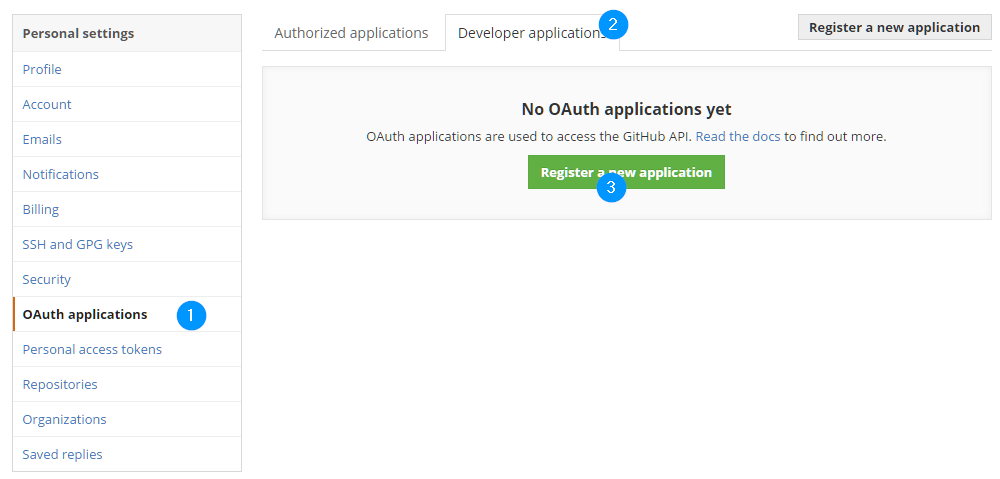
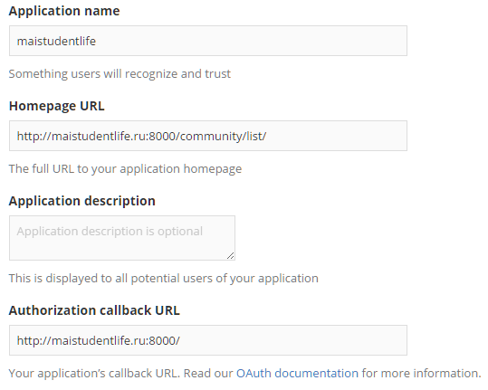

# Django Social Auth

Для начала, убедимся, что на компьютере находится нужная версия репозитория [mai-student-life](https://github.com/lambda-frela/mai-student-life/tree/0479dedcb4e9cda04734229ae895ca8a6a1257cf) 

1. заходим в папку, в которой хранятся репозитории, открываем в ней командную строку
2. `git clone https://github.com/lambda-frela/mai-student-life.git`
3. `cd mai-student-life`
4. `git checkout social`
5. `git checkout 0479dedcb4e9cda04734229ae895ca8a6a1257cf`
6. `cd project`
7. `python manage.py makemigrations`
8. `python manage.py migrate`
9. `python manage.py runserver`

Устанавливаем библиотеку **python-social-auth** через `pip`
```
pip install python-social-auth
```

Открыть файл **`c:\Windows\System32\Drivers\etc\hosts`** с правами администратора, добавить в конец:

`127.0.0.1    maistudentlife.ru`

Добавить в `settings.py`:

1\. Новое приложение - `social.apps.django_app.default`

```python
INSTALLED_APPS = [
    'django.contrib.admin',
    'django.contrib.auth',
    'django.contrib.contenttypes',
    'django.contrib.sessions',
    'django.contrib.messages',
    'django.contrib.staticfiles',
    'common',
    'community',
    'bootstrap3',
    'rest_framework',
    'social.apps.django_app.default',
]
```

2\. Обработчики шаблонов `social.apps.django_app.context_processors.backends` и `social.apps.django_app.context_processors.login_redirect`

```python
TEMPLATE_CONTEXT_PROCESSORS = (
   'django.contrib.auth.context_processors.auth',
   'django.core.context_processors.debug',
   'django.core.context_processors.i18n',
   'django.core.context_processors.media',
   'django.core.context_processors.static',
   'django.core.context_processors.tz',
   'django.contrib.messages.context_processors.messages',
   'social.apps.django_app.context_processors.backends',
   'social.apps.django_app.context_processors.login_redirect',
)
```

3\. Сайты, через которые будем авторизовываться. Полный список можно посомтреть [здесь](http://psa.matiasaguirre.net/docs/backends/index.html#supported-backends). Мы будем авторизовываться через Github:

```python
AUTHENTICATION_BACKENDS = (
   'social.backends.github.GithubOAuth2',
)
```

Теперь откроем файл `project/website/urls.py`, найдем строку `urlpatterns`.

Добавим группу URLов, отвечающих за авторизацию:
```python
    url('', include('social.apps.django_app.urls', namespace='social')),
```

Так как будем входить и выходить много раз, добавим `django.contrib.auth.urls`:
```python
    url('', include('django.contrib.auth.urls', namespace='auth')),
```

Конечный результат:
```python
urlpatterns = [
    url(r'^admin/', admin.site.urls),
    url(r'^community/', include('community.urls', namespace='community')),
    url(r'^', include('common.urls', namespace='common')),
    url('', include('social.apps.django_app.urls', namespace='social')),
    url('', include('django.contrib.auth.urls', namespace='auth')),
] + static(settings.MEDIA_URL, document_root=settings.MEDIA_ROOT)

```

Теперь необходимо обновить базу данных сайта, чтобы наши интеграции встали на место: `python manage.py syncdb`

Добавим кнопку авторизации в **navbar**, используя элементы маркированного списка `<li></li>`. Если пользователь авторизован, то появится строка приветствия и кнопка выхода с сайта. В противном случае - кнопка авторизации через подключенные сервисы, в данном случае, Github:

```html

        <li>
            <a>Hello {{ user.get_full_name|default:user.username }}!</a>
        </li>
        <li>
            <a href="?next={{ request.path }}">Logout</a>
        </li>
    
        <li>
            <a href="?next={{ request.path }}">Login with Github</a>
        </li>
    
```

Конечный вид файла `common/templates/common/navbar.html`:
```html


<ul class="nav nav-pills">
    <li class="">
        <a href="">Communities</a>
    </li>
    <li class="">
        <a href="">About</a>
    </li>
    
        <li>
            <a>Hello {{ user.get_full_name|default:user.username }}!</a>
        </li>
        <li>
            <a href="?next={{ request.path }}">Logout</a>
        </li>
    
        <li>
            <a href="?next={{ request.path }}">Login with Github</a>
        </li>
    
</ul>
```

На сайте:


Вернемся в файл `settings.py` и предотвратим возникновение ошибки **404** при вызове url `/account/profile`, для этого добавим параметр `LOGIN_REDIRECT_URL`, который будет перенаправлять нас после авторизации в нужное место на сайте, например, на главную страницу со списком сообществ:

```python
LOGIN_REDIRECT_URL = '/'
```

--------

На этом основная подготовка заканчивается. Следующий этап - получение ключей авторизации для приложения.


Для авторизации на Github будем пользоваться протоколом `OAuth2` Зайдем в настройки пользователя на Github, раздел **OAuth applications**, вкладка **Developer application**, там нажимаем на кнопку **Register a new application**:



Заполняем форму по образцу:
1. **Application name**: maistudentlife _(может быть любое)_
2. **Homepage URL**: `http://maistudentlife.ru/` _(желательно, чтобы адрес был с доменом .com, .net, .org, .ru, etc.)_
3. **Authorization callback URL**: `http://maistudentlife.ru:8000/` _(так как наш сайт нигде не зарегестрирован, а название прикручено через `hosts`, надо указать порт, к которому будет обращаться Github для возврата одобрения авторизации)_



Получаем **Client ID** и **Client Secret**


Открываем `settings.py` и добавляем в него эти значения:

```python
SOCIAL_AUTH_GITHUB_KEY = 'XXXXXXXXXXX'
SOCIAL_AUTH_GITHUB_SECRET = 'XXXXXXXXXXXXXXXXXXXXXXX'
```

Теперь наш сайт может общаться с Github!


