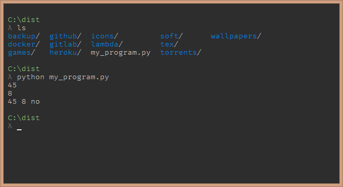

# Python - немного истории

## Гвидо Ван Россум


> Over six years ago, in December 1989, I was looking for a "hobby" programming project that would keep me occupied during the week around Christmas. My office ... would be closed, but I had a home computer, and not much else on my hands. I decided to write an interpreter for the new scripting language I had been thinking about lately...


## Идейный вдохновитель - ABC

```
HOW TO RETURN words document:
   PUT {} IN collection
   FOR line IN document:
      FOR word IN split line:
         IF word not.in collection:
            INSERT word IN collection
   RETURN collection
```

## Цель

- создать простой, понятный, удобный и полезный язык
- пример функции:
```python
def magic(dir):
    arc = []
    for root, dirs, files in os.walk(dir):
        acc.extend(os.path.join(root, file) for file in files)
    return acc
```
- что делает эта функция?

## 2.x VS 3.x

- Python 2.x находится в режиме поддержки, обновлений выходить не будет
    - достоинства
        - штабильно
        - громадное количество библиотек
        - `print "hello world"`
    - недостатки
        - содержит много костылей, исправить которые, не нарушив работу системы нельзя
        - строки и символы изначально кодируются в байткод

- Python 3.x - в режиме активной разработки
    - достоинства
        - все строки ялвяются Unicode объектами
        - упрощены некоторые конструкции методов
        - бОльшая часть элементов языка стала объектами (например, `map` по версии 2.x - `list`, по версии 3.x - `map object`)
    - недостатки
        - не все библиотеки портированы с 2.x

В наших проектах будем использовать Python 3.x, для упрощения процедуры поддержки кода

## _Let the Holywar begin!_


# Ввод/вывод


```python
my_variable = input() # ввод данных с клавиатуры (или через стандартный ввод stdin)

print(my_variable) # вывод данных в стандартный вывод stdout
```

    42
    42
    


```python
coords, speed, velocity = input(), input(), 'no'
print(coords, speed, velocity)
```

    34
    45
    34 45 no
    

# Запуск программы

1. открыть консоль
2. `cd <пусть\к\папке\с\файлом>`
3. `python my_program.py`
    - для пользователей Ubuntu/Debian: `python3 my_program.py`
    


# Некоторые стандартные типы данных

- числовые
    - целые числа `int` - 5
    - вещественные числа (с плавающей точкой) `float` - 5.0
    - логические `bool` - True/False
- строковые
    - строки `str`
    
### чтобы узнать тип переменной (объекта) - `type(x)`

## Преобразование типов

- `int(x)` - преобразование к целому числу
    - `int(2.3)` -> 2
- `float(x)` - преобразование к числу с плавающей точкой
    - `float(5)` -> 5.0
    

### _task 1_
вычислить выражение
```python
9**19 - int(float(9**19))
```

# Мотан

- базовые операторы


```python
print(42 + 24) # сложение
print(45 - 100) # вычитание
print(3 * 98) # умножение
```

    66
    -55
    294
    

- оператор деления


```python
print(7 / 3) # дробный результат деления
print(7 // 3) # целочисленный результат деления (аналог div в pascal)
print(7 % 3) # остаток от деления (аналог mod в pascal)
```

    2.3333333333333335
    2
    1
    

- возведение в степень


```python
print(2 ** 8)
```

    256
    

### _task 2_

Допустим, нам нужно проанализировать математическую модель, описывающую движение тела, подброшенного вертикально вверх:
$$y(t) = v_0 t - \frac{gt^2}{2}$$

написать алгоритм, принимающий значение $t$ при заданных $g = 9.81$ и $v_0 = 5$, чтобы найти координату $y$


```python
v0 = 5
g = 9.81
t = float(input())

y = v0 * t - (1/2) * g * t**2
print(y)
```

    0.6
    1.2342
    

# Строки

Строки могут быть:

- однострочными:

```python
not_very_long_string = 'wow, such little code here'

# wow, such little code here
```

- однострочными с переносами при помощи символа `\n`:

```python
not_very_long_string = 'wow, \nsuch little \ncode here'
```
- или просто многострочными:

```python
very_long_string = """wow, 
    such little
    code here"""

# wow, 
# such little
# code here
```

## Форматирование текста и чисел

```python
"spam = %s, eggs = %d" % ("blah", 2)
# spam = blah, eggs = 2
```

| флаг 	| описание                                                	|
|------	|---------------------------------------------------------	|
|  %s  	| строка                                                  	|
|  %d  	| целое число                                             	|
|  %f  	| десятичное представление с шестью знаками после запятой 	|
|  %e  	| "научное" представление                                 	|
|  %g  	| компактное представление десятичного числа              	|
|  %%  	| вывод знака процента                                    	|

Начиная с версии 3.x существует альтернативный путь:
```python
"spam = {0}, eggs = {1}".format("blah", 2)
```

## _"математические"_ операции со строками

- конкатенация:


```python
'lorem' + 'ipsum'
```


    'loremipsum'


- умножение:


```python
'lorem ipsum ' * 3
```


    'lorem ipsum lorem ipsum lorem ipsum '


- сравнение по значению (аналог `.equals()` в Java)


```python
'lorem ipsum' == 'lorem ipsum'
```


    True


```python
'lorem ipsum' == 'hello world'
```


    False


# Логика

## Операторы сравнения


```python
C = 40

print(C == 40)  # C равно 40
print(C != 40)  # C не равно 40
print(C >= 40)  # C больше или равно 40
print(C >  40)  # C больше 40
print(C <  40)  # C меньше 40
```

    True
    False
    True
    False
    False
    

## Логические выражения


```python
x = 0; y = 1.2
x >= 0 and y < 1
```


    False


```python
x >= 0 or y < 1
```


    True


```python
x > 0 or not y > 1
```


    False


```python
not (x > 0 or y > 0)
```


    False


# Условные операторы

## if - else

```python
if x % 2 == 0:
    print('Четное')
else:
    print('Нечетное')
```

## много условий

```python
if statement_1:
    expression_1
elif statement_2:
    expression_2
else:
    expression_3
```

## тернарный оператор

```python
"четное" if x % 2 == 0 else "нечетное"
```

## _task 3_

Требуется определить, является ли данный год високосным.

Напомним, что високосными годами считаются те годы, порядковый номер которых либо кратен 4, но при этом не кратен 100, либо кратен 400 (например, 2000-й год являлся високосным, а 2100-й будет невисокосным годом). 

Программа должна корректно работать на числах $1900 \leqslant n \leqslant 3000$.

Выведите "__Високосный__" в случае, если считанный год является високосным и "__Обычный__" в обратном случае (не забывайте проверять регистр выводимых программой символов).


```python
year = int(input())

if ((year % 4 == 0) and (year % 100 != 0)) or (year % 400 == 0):
    print('Високосный')
else:
    print('Обычный')
```

    2100
    Обычный
    

# Функции

Простейший пример:

```python
def foo():
    return 42
    
# 42
```

если не используется `return`, функция по умолчанию возвращает `None`:

```python
def foo():
    42
print(foo())

# None
```

## Передача аргументов


```python
def min(x, y):
    return x if x < y else y
```


```python
min(-5, 12)
```


    -5


```python
min(x=12, y=-5)
```


    -5


### _task 4_

Напишите функцию f(x), которая возвращает значение следующей функции, определённой на всей числовой прямой:

$$f(x)= \begin{cases}   1 - (x + 2)^2,\quad &\text{при  } x\le -2\\  -\frac x2 ,\quad &\text{при } -2 \lt  x \le 2\\   (x-2)^2 + 1,\quad &\text{при }  2 \lt  x \end{cases}$$

| Ввод 	| Вывод 	|
|------	|-------	|
| 4.5  	| 7.25  	|
| -4.5 	| -5.25 	|
| 1    	| -0.5  	|


```python
def f(x):
    if x <= -2:
        return(1-(x+2)**2)
    if x > -2 and x <= 2:
        return(-(x/2))
    if x > 2:
        return(((x-2)**2)+1)

f(1)
```


    -0.5


# ДЗ

1. Решить 11 задачек из модуля [String-1](http://codingbat.com/python/String-1) на **CodingBat**
2. Отчитаться о выполнении в [чате](https://lambdafrela.slack.com/messages/general/)
